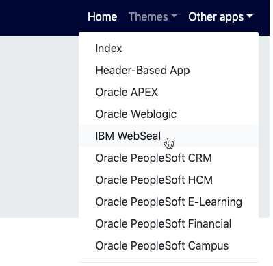

# 1. header-app-tester

This app is used to emulate apps that use header-based authentication for Single Sign-On (SSO) integrations.


- [1. header-app-tester](#1-header-app-tester)
- [2. Why emulating those apps (instead of just integrating directly)?](#2-why-emulating-those-apps-instead-of-just-integrating-directly)
- [3. What apps this sample can emulate?](#3-what-apps-this-sample-can-emulate)
- [4. Running the sample app](#4-running-the-sample-app)
    - [4.1. Example (already running)](#41-example-already-running)
    - [4.2. Heroku](#42-heroku)
    - [4.3. Docker](#43-docker)
    - [4.4. Node.js](#44-nodejs)
- [5. How to improve this app with more samples?](#5-how-to-improve-this-app-with-more-samples)

# 2. Why emulating those apps (instead of just integrating directly)?

If you integrated or changed code of an app to support SSO using headers variables, you probably ran thru a bunch of issues like:
- Figuring out what headers to use in a given app
- Getting a network administrator to open the proper network ports
- Unit testing the integration before connecting to the "real thing"

With this sample, you can test the integration before running thru these issues, simplifying your integration and helping with troubleshooting.

# 3. What apps this sample can emulate?

The sample app currently supports:

- Header-Based App
- Oracle Application Express (APEX)
- Oracle WebLogic Server
- Oracle PeopleSoft CRM
- Oracle PeopleSoft HCM
- Oracle PeopleSoft Enterprise Learning Management
- Oracle PeopleSoft Financial
- Oracle PeopleSoft Campus
- IBM WebSeal

To navigate thru the samples, use the menu on the top-right corner:



# 4. Running the sample app

You have 4 options:

## 4.1. Example (already running)
Just click https://on-prem.herokuapp.com

## 4.2. Heroku
*In case you want to run your own dedicated instance over the internet.*

Just click this button, follow the instructions:

[](https://heroku.com/deploy)

After deployment, your app will be available at `https://<your-domain>.herokuapp.com`.

## 4.3. Docker 
*In case you want to test from your intranet (and you have Docker in your `server`).*

From a computer with Docker, launch a terminal and enter the following:
```
docker pull fhakamine/header-app-tester
docker run -p 3000:3000 -d fhakamine/header-app-tester
```

After deployment, your app will be available at `https://localhost:3000`.

By the way, For more info about the Docker repo for this app, click any of these links 🙂 : 

[](https://hub.docker.com/r/fhakamine/header-app-tester/)
[](https://hub.docker.com/r/fhakamine/header-app-tester/)
[](https://microbadger.com/images/fhakamine/header-app-tester)
[](https://microbadger.com/images/fhakamine/header-app-tester)


## 4.4. Node.js
*The good ol just run straight from your machine (if you have Node.js installed)*

Clone this repo and run like any other Node.js project:
```
git clone https://github.com/sudobinbash/header-app-tester.git
cd header-app-tester
npm install
node start.js
```

After deployment, your app will be available at `https://localhost:3000`.

# 5. How to improve this app with more samples?

Extend `routes/index.js` with a new route for your app:

```
router.use('/webseal', require('./webseal'));
```

Create a file for your route by copying the sample file to `webseal.js` :

```
cd routes
cp sample_app.js webseal.js
```

Edit your route (i.e. `routes/webseal.js`) file on the following sections:

**Headers**: Update the `attributes` constant with each header name and description expected by the sample app. For example:
```
const attributes = [
  {"id":"iv-user","description":"User id sent by WebSeal to backend apps. It can be a generic user id or an email"},
  {"id":"iv-groups","description":"User groups separated by comma (,) and quoted )(i.e. \"admin\",\"end-user\").  typically from an LDAP or AD store"},
];
```

**Metadata**: Update the `title`, `description`, and `doc` constant with the application metadata. For example:
```
const title = 'IBM WebSeal';
const description = 'WebSEAL is a reverse-proxy from IBM that enforces SSO and authorization integrated to IBM Tivoli Access Manager or IBM ISAM. Applications integrated thru WebSeal typically use the same header variables.';
const doc = 'https://www.ibm.com/support/knowledgecenter/en/SSPREK_7.0.0/com.ibm.isam.doc_80/ameb_webplugin_guide/concept/con_sso_plugin_ws.html';
```

**URLs**: Update the `urls` constant with each uri and description expected by the sample app. For example:
```
const urls = new Map([['/', 'Index'],['/public', 'Public'],['/private', 'Private'],['/admin', 'Admin']]);
```

**Header validation**: Update the router path with the header validations to be executed. The header validation (i.e. `header('oam_remote_user').not().isEmpty().isEmail(),`) is executed using `express-validator` (examples of validation and sanitization here: https://express-validator.github.io/docs/sanitization.html).

```
router.get(Array.from(urls.keys()),[
    header('iv-user').not().isEmpty(),
    header('iv-groups').not().isEmpty(),
```
